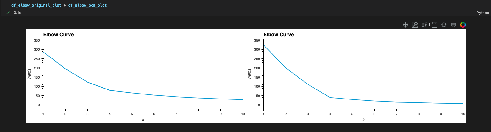

# cryptos_clusters

## Cryptocurrencies clustering using unsupervised learning

Combining financial Python programming skills with unsupervised learning to create a Jupyter notebook that clusters cryptocurrencies by their performance in different time periods and plot the results to visually show the performance to the board.

Please be sure to install all the prerequisites (libraries) before running the program:

- `pip install sklearn`
- `pip install hvplot.pandas`

The other libraries, **json, requests, and os** should be installed by default. If not, run the same *pip install "libraby name"* command.

After completing the prereq, run the [crypto_investments.ipynb](crypto_investments.ipynb) notebook. See following screenshot as example outputs of the comparison between the original Elbow Curve and the PCA one:

